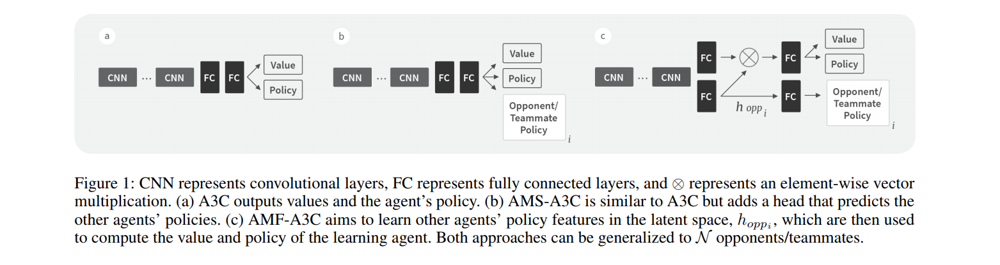

# Agent Modeling as Auxiliary Task for Deep Reinforcement Learning
#### Hernandez-Leal, Kartal, Taylor (2019)

In this work, the authors propose a representation learning approach to improve performance in multi-agent RL by teaching the agent to model its opponent/teammate policy, an auxiliary task referred to as *agent modeling*.

