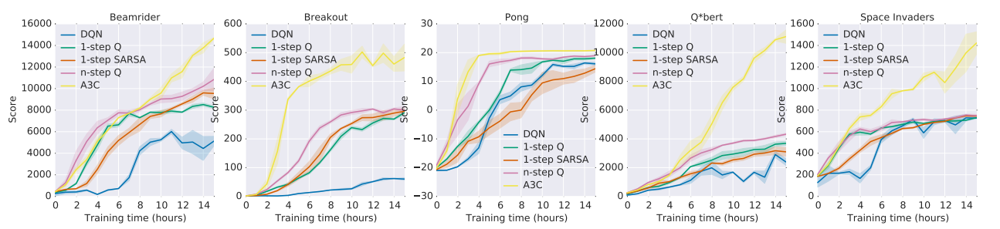

# Asynchronous Methods for Deep Reinforcement Learning
#### Mnih *et al.* (2016)

In this work, the authors propose Asynchronously train in parallel multiple agents each in their own copy of the environment as an alternative to Experience Replay.

**Main mechanism:** Each actor-learner thread interacts with its own copy of the environment, generate its own gradient, but instead of applying it to itself, it sends its gradient to a main server which accumulates them from every actor-learner, updates the model and periodically sends the most recent model to its actor-learner threads so they can be updated too.

**Motivation:** Experience Replay is great because it allows to batch experience (improves computational efficiency) and decorrelates updates (improves statistical efficiency), but limits the agents to off-policy algorithms. They argue their asynchrnous approach also deccorelates updates, but can be used with either on-policy or off-policy methods (as well as value-based and policy-based methods and discrete and continuous control problems).

They adapt 4 classic algorithms to this asynchronous technique:
* 1-step Sarsa
* 1-step Q-Learning
* n-steps Q-Learning (forward view)
* n-steps Advantage Actor-Critic

Their best performing algorithm is the Asynchrnous Advantage Actor-Critic (A3C). It achieved state-of-the-art on Atari-2600 in half the training time (they train on a single CPU!). Reduction of training time is nearly linear in the number of actor-learner threads.

### Other interesting tricks

* Use different exploration policy for each different actor-learner threads (randomly sample the epsilon param for each episode)
* For A3C, all non-output layers are shared between ACtor and Critic (pretty standard, but still)
* They add an Entropy Regularization term to the Actor objective function for A3C which they say "discourages premature convergence to suboptimal deterministic policies".
