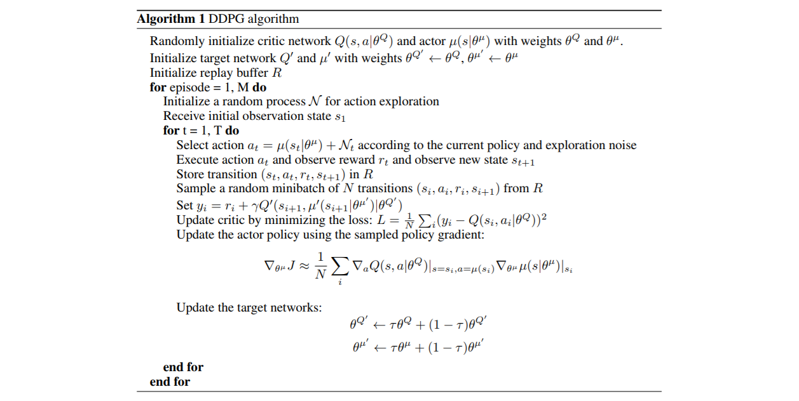

# Continuous Control with Deep Reinforcement Learning (DDPG)
#### Lilicrap *et al.* (2016)

In this work, they basically just apply Batch Normalization and DQN stabilization tricks to DPG and obtain a simple and stable off-policy algorithm for continuous and deterministic control that use non-linear function approximation. They show that DDPG can learn good policies in a variety of Mujoco environments, either from low-dimensional or pixel-based observation spaces.

### Main features

* **Replay buffer** : (like for DQN) decorrelates samples between learning steps and allows minibatch updates (hardware efficient)
* **Target networks** : (like for DQN) stabilizes learning but also slows learning. They use *soft-updates*.
* **Batch Normalization** : to avoid problem-wise handcrafted normalization and allow good performance across different environments
* **Exploration** : they simply add noise sampled from a chosen noise process to the actor's output. They choose their noise generated process to be *temporally correlated* to have a time dependant exploration.

