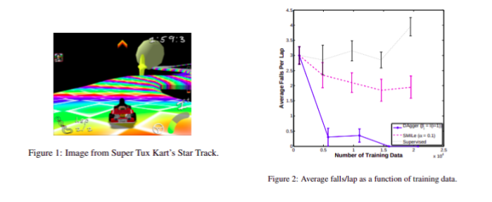

# A Reduction of Imitation Learning and Structured Prediction to No-Regret Online Learning (DAGGER)
#### Ross et al. (2010)

In this work, the authord propose DAgger, an imitation learning that leverages access to the expert policy to reduce the distributional shift and compouding error problem with behavioral cloning.

### The algorithm

From an implementation perspective, the algorithm is simple and builds on Behavioral Cloning (i.e. naive supervised learning approach to imitation learning). It can be described as so:

  1. train the policy on (observations, actions) dataset
  2. run the policy to get a batch ob observations distributed wrt the current policy
  3. use the expert policy to label (pick actions) for the newly collected observations
  4. aggregate (add new observations-actions to the dataset), return to step 1

### The algorithm

The algorithm reduces the distributional shift because it labels observations encoutered by the learned policy rather than collected by the expert policy, reducing significantly the expected error at execution time. However, this procedure involves several labelling cycles which can be expansive. Also, it assumes possession of the expert policy which in some cases raises the question: why would you train a new policy if you have in your possession the expert policy? In the case of human labelling it makes sense, because say in the case of drone navigation for rescue, labelling is tedious and slow but once you have a good policy, you can deploy many many drones and they all navigate quickly, however, this assumption is still very restrictive for other kind of tasks. 

### Theoretical contributions

They offer a number of theoretical contributions in the form of garantees for DAgger and bounds on the expected error. (I need to read more about previous work on imitation learning to truly understand these contributions and summarise them)

### Experiments

They run experiments on Super Tux-Kart (a kart-racing game), Super Mario Bros. and a sequential handwritten digit recognition task.

