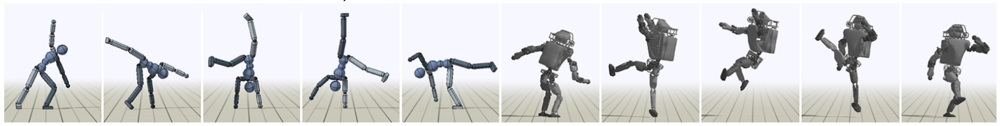
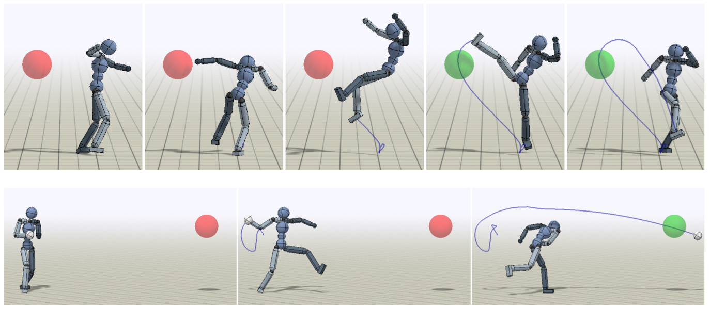

# DeepMimic: Example-Guided Deep Reinforcement Learning of Physics-Based Character Skills

#### Peng, Abbeel, Levine, Van de Panne (2018)

In this work, the authors combine reinforcement learning with imitation learning to train policies that can control various physics based characters to perform different motions in a natural fashion while having the capacity to tweak their movement to accomplish tasks like kicking a target, avoiding obstacles or recovering from perturbations.

They provide "a framework for physics-based character animation that combines goal-directed reinforcement learning with data". The use of data offers an alternative to the difficult task of specifying a reward function for natural movement.

**states**: concatenation of every joint relative position to the root, joint angles (quaternions), root position, joint positional and angular velocities, a *phase variable* indicating where we are at in the provided example-motion and finally a *goal* if the agent is performing a task (could be the position of the target, the direction to follow, etc.).
**actions**: defined as angular shifts and an external PD-controller translates them into torques applied to the simulated character (which could explain why they don't use supervised learning to train the model for motion-imitation).
**transitions**: they use a simulator called *Bullet* to detect collisions, apply motion etc. in their physical world. The policy is queried at 30Hz while the physics simulator runs at 1200Hz.
**rewards**: they combine two sources of reward to train the agent, a motion-imitation reward and a task-specific reward. The first one is computed by measuring some positional and angular offset as well as velocity differences between the controlled character and the provided motion data. The second is a more classic reward that we would see in RL tasks (rewards if the agent touches the target, etc.).

### Training
* They train two networks (Actor-Critic). The actor is trained off-policy using Proximal Policy Optimization (PPO) while the critic models the state-value function V(s) and is trained off-policy (*I think*) with the TD-lambda algorithm. Advantages are computed using the approximated V(s) and the lambda-Return (generalized advantage estimator or GAE).
* Takes about 2 days of training per motion/task. Everything is run on CPU

### Exploration tricks
* **Reference state initialization:** Initialize the episode at different frame of the provided example-motion.
* **Early Termination:** Stops the episode when huge fail occurs (like falling down). This prevents the agent of sacrificing capacity to learn to reach local minima by trying to perform a flip while laying on the ground.

### Multi-skill integration
* 
* 
* 

### Environment adaptations
*
*
*

### Other perks of the paper

* Clear and concise explanations of Off-Policy Policy Gradient, TD-lambda and PPO
* Good accompanying video

