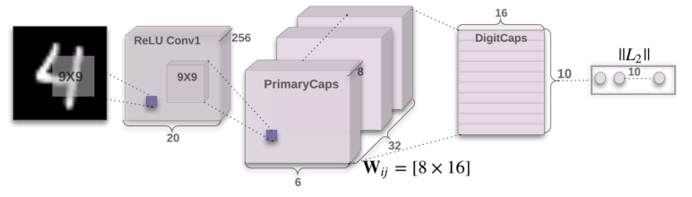
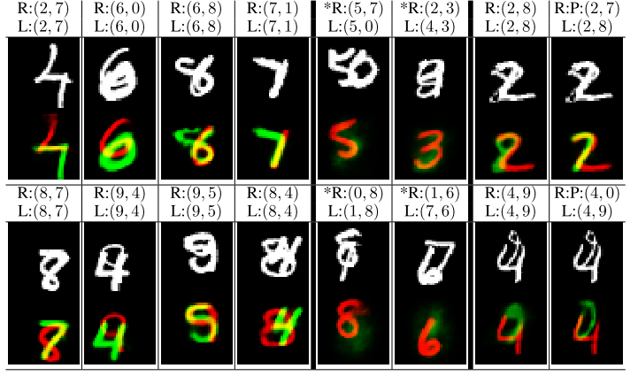

# Dynamic Routing Between Capsules
#### Sabour, Frosst, Hinton (2017)

The authors introduce a new kind of network, currently applied to vision tasks, that is designed to overcome some difficulties met by the now dominant CNNs. This new architecture creates 

**Keypoints**
* Capsules : a group of neurons whose activity vector represents the instanciation parameters of a specific type of entity.
** Their length represents a probability that the entity exists at that spatial location.
** Their orientation (dimensions) represent the instanciation parameters themselves.
* Routing by agreement : allows each active capsule to choose a capsule in the layer above to be its parent.
* Prediction vector : computed by each capsule for each of its potential parent
* Agreement : scalar product between prediction vector of the child and activation vector of the parent
** When the agreement is strong between a pair of capsules, their coupling coefficient is increased and the parent's coupling coefficient with the other children is decreased, which iteratively leads to a specific routing.

* BASICALLY : CNN's scalar output is replaced by vectorial capsules (neurons grouped together) and max-pooling is replaced by Routing-by-agreement.

**Results**
* Very good at classification on MNIST (and some other datasets)
* Much better at segmentation because of the "voting system" between capsule layers.
* More robust to affine transformations

