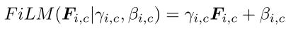
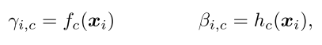
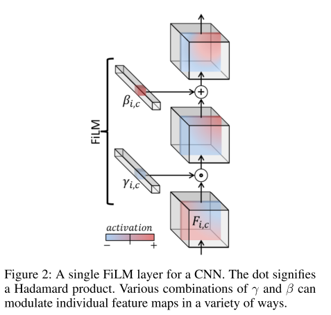
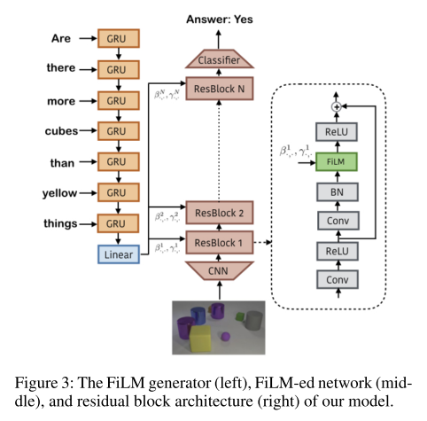
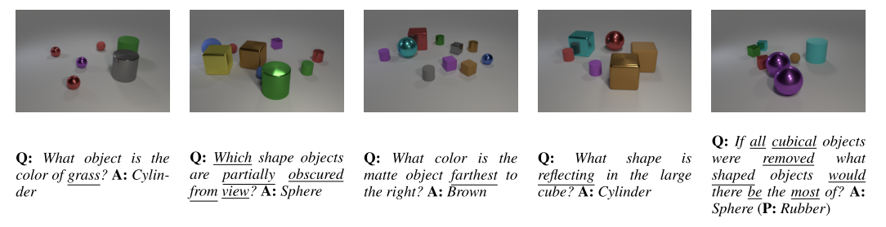

# FiLM : Visual Reasoning with a General Conditioning Layer
#### Perez, Strub, de Vries, Dumoulin, Courville (2017)

This paper is a follow-up from the one that introduced [Conditional Instance Normalization](../LearnedRepresentationForArtisticStyle/LearnedRepresentationForArtisticStyle.md). Here instead of normalizing layer's activations based on a conditionned scalar representing a visual style, they use the same normalization process, but on the feature maps level, and use normalization parameters per feature-map and per-layer. Those scaling and shifting parameters are generated by a separate network.

### Keypoints
* **FiLM** : Feautre-wise Layer Modulation to adaptively influence the output of a neural network.
	* Consists of a set of two vectors, gamma and beta, for each layer (gamma contain the scaling parameter for each feature-map, beta contains the shifting parameters).
	* These conditional normalization parameters are computed by one network (FiLM-generator) and applied to the layer's activations of another (FiLM-ed network).
	* Gamma and beta are computed based on an input example. This input could either be the same OR different between the FiLM-generator and the FiLM-ed net. This allows, for example, to influence the computation of an image in a CNN based on a question fed to a RNN.
	* Gamma is responsible for most of the conditionning effect (figure 7)

### Capabilities
* Achieve new state-of-the-art of CLEVR dataset.
* Gamma allows to upregulate and downregulate (even completely shut off) entire feature maps, as Beta allows to be selective about which activations pass the ReLU.
* Indirectly induce spatial modulation (regions with question-relevant features will have large activations).
	* This effect is similar to the benefits provided by attention mechanisms, but at the same time influences feature representation (which attention does not).

