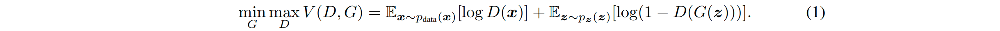
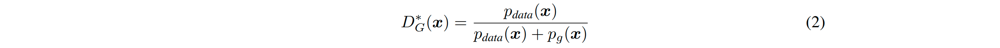
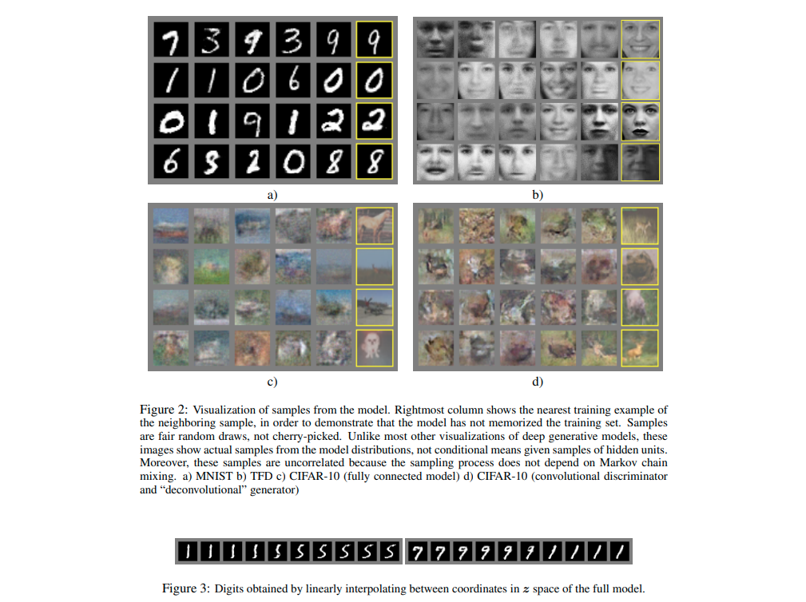

# Generative Adversarial Nets
#### Goodfellow et al. (2014)

In this work, the authors present a now famous adversarial framework to unsupervised generative modelling.

### Algorithm

The algorithm trains at the same time a Generator G(z) which learns a mapping from sampled noise z to generated datapoints x and a Discriminator D(x) which learns to discriminate between samples x from the true data distribution and those from the generator's distribution. When G and D are parametrized using neural networks, the system can be trained end-to-end using backpropagation to perform alternating gradient descent on the following minimax game:

The following figure and algorithm from the papers give a very clear exposition of the training procedure. Importantly, the authors recommend to maximise log(D(G(z))) rather than directly minimising the above objective to train the Generator to provide a stronger learning signal when the discriminator is much more succesful than the generator.

### Theoretical analysis

The theoretical contributions of the paper are twofolds and focus on a non-parametric (infinite capacity) setting:

  1. The authors show that the unique global optima of the game is achieved if and only if p_g = p_data. They also show that the optimal discriminator D* for a fixed G is given by:

  2. The authors provide a convergence proof of GANs for the non-parametric setting (which is not applicable when GANs are implemented with finite capacity, aka real life).

### Experiments

The experiments show generated samples for a number of datasets as well as some series of samples resulting of interpolations in the z-space.

Since computing the exact likelihood of generated samples under p_g is intractable when G is parametrized with an MLP, the authors "estimate the probability of the test data under p_g by fitting a Gaussian Parzen window to the samples generated by G and report the log-likelihood under this distribution" instead.

### Advantages

  * Components of the inputs cannot be copied into G (it only learns using gradients passing through D and does not have direct access to data samples)
  * Can represent very sharp distributions (in contrast with VAE and MCMC methods)
  * No need for Markov chains or inference during learning
  * Very flexible (a wide variety of functions can be incorporated into the model)

### Disadvantages
  * Can be unstable (require good synchronisation during training between G and D)
  * No explicit representation of p_g (but that is more caused by some choices of parametrisation for G and not caused by the GAN framework in general)
