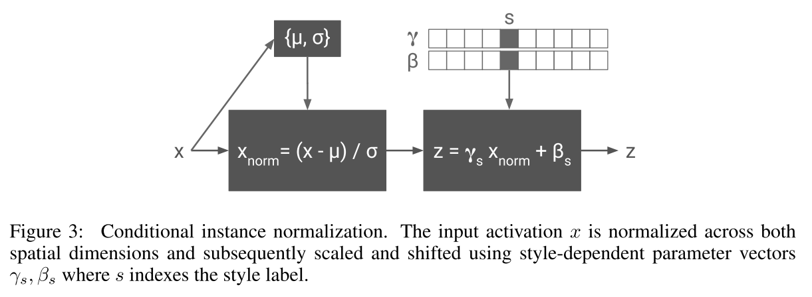

# A Learned Representation for Artistic Style
#### Dumoulin, Shlens, Kudlur (2017)

The authors introduce a simple trick, *Conditional Instance Normalization*, that allows to train a model to perform style transfer from a set of N different styles, or a combination of them (unlike traditional Style Transfer Networks that are trained to perform this transformation for a single style).

### Previous work

In the classic Style Transfer Networks, a convolutional net is trained to generate an image that minimizes the sum of content-loss and style-loss. These losses (from *Gatys et al.*) are computed by extracting the deep features generated by an image classifier such as VGG. So to train : 
* 1 forward pass in StyleTransfer Network
* 3 forward passes in VGG (content, style and generated images)
* Computing of the losses (feature maps and gram matrices distances)
* 1 backward through the StyleTransfer Network only (not VGG)

### Motivation

Many styles probably share some degree of computation (this sharing is thrown away when you train N networks for N styles).

### Keypoints
* **Conditional Instance Normalization** : consists of applying a style specific scaling and shifting transformation to the normalized activations of each layer (nor clear if this transformation is applied to every layer or only input layer).
 * Each style image is therefore represented aa a point in an embedding space
 * It is this embedding representation that allows to combine different styles
* **Most parameters are shared accross styles** : only the embedding matrix represents only about 0.2% of the network's parameters 

### Capabilities
* Performing style transfer to any of N different styles in real-time (N=32 in the paper).
  * Can even do them all in one feedforward pass with batch size N
* Adding a new style (N+1th) much more quickly than what it takes to train an individual Style Transfer Network from scratch
* Combining two or more styles by interpolating their embedding vectors

