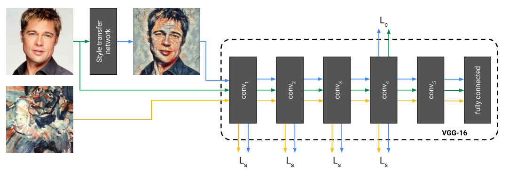
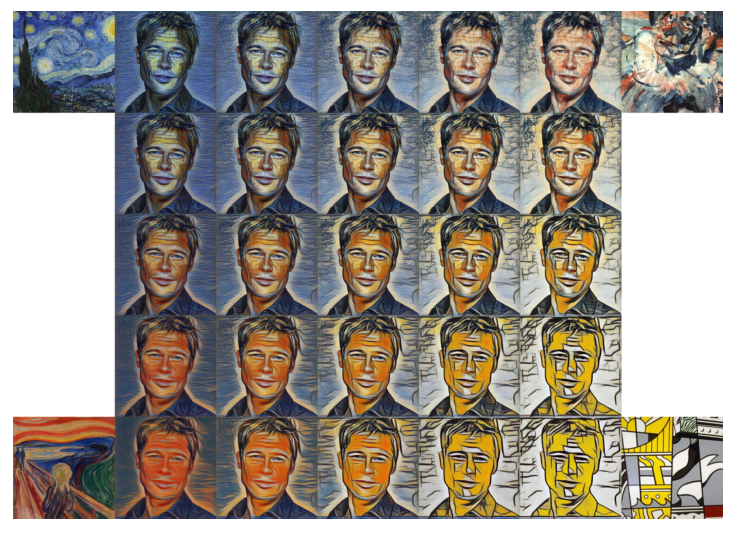

# A Learned Representation for Artistic Style
#### Dumoulin, Shlens, Kudlur (2017)

The authors introduce a simple trick, *Conditional Instance Normalization*, that allows to train a model to perform style transfer from a set of N different styles, or a combination of them.

### Keypoints
* 

### Capabilities
* Performing style transfer to any of N different styles in real-time (N=32 in the paper).
  * Can even do them all in one feedforward pass with batch size N
* Adding a new style (N+1th) much more quickly than what it takes to train an individual Style Transfer Network from scratch
* Combining two or more styles by interpolating their embedding vectors

