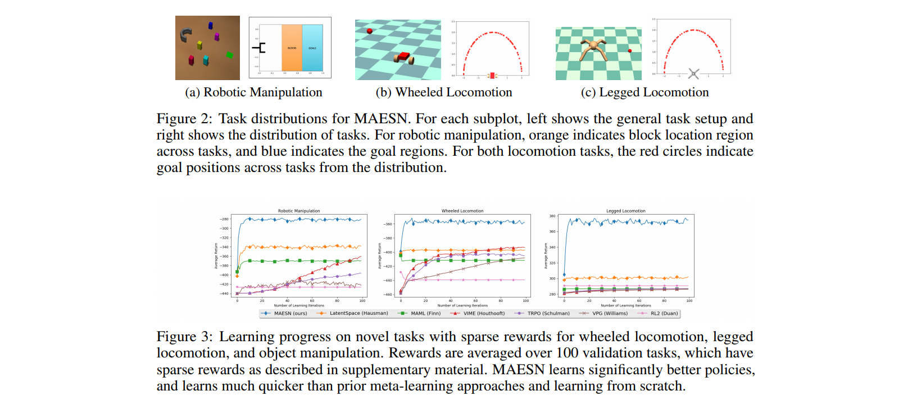
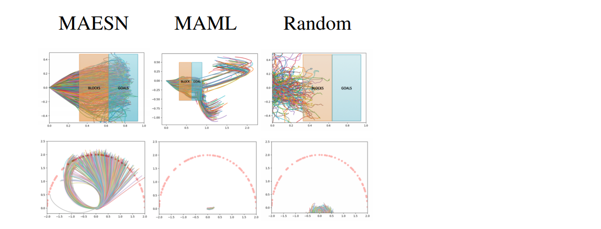

# Meta-Reinforcement Learning of Structured Exploration Strategies
#### Gupta, Mendonca, Liu, Abbeel, Levine (2018)

In this work, the authors augment [MAML](Papernotes/notes/ModelAgnosticMetaLearning/ModelAgnosticMetaLearning.md) algorithm (gradient-based meta-learning algorithm) with a latent exploration space meta-learning objective. This allows the agent to learn from prior (dense reward) tasks how to explore in a more strutured way (temporally coherent exploration rather than simple random noise exploration) for similar tasks with sparse reward.

*"Both the policy and the latent space are trained through meta-learning to explicitly provide for fast adaptation to new tasks."*

### How to explore in a temporally coherent fashion ?

Instead of exploring by adding random noise to the action-selection process on a step by step basis, the policy is conditionned on a random variable *z* which is sampled from a learned latent exploration space. This latent space is parametrized by a set of means and variaces, and regularized to remain close to a spherical gaussian before the inner-update (task specific update). Since this *exploration variable* is sampled only once for the whole episode, *the policy decides on what it wants to do in each episode, and commits to this plan.*

This way of exploring can be seen as a higher level exploration strategy that seeks to explore on a trajectory scale rather than a single timestep scale. The objective is to randomly select randomly among useful (coherent) behaviors and avoid those that are highly unlikely to succeed (like an entirely random angent).

See similar work by [*Hausman et al.*](https://openreview.net/pdf?id=rk07ZXZRb).

