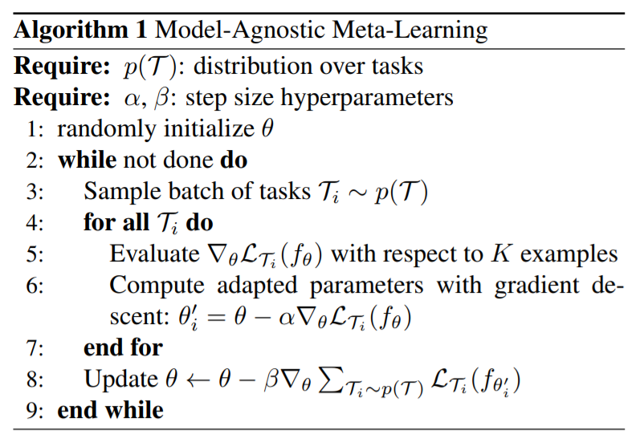

# Model-Agnostic Meta-Learning for Fast Adaptation of Deep Networks (MAML)
#### Finn, Abbeel and Levine (2017)

In this work, they present a meta-learning algorithm that uses a set of similar tasks in order to provide an initialization point that allows for fast specialization-learning to a new (but similar) task. This is motivated by the idea that some internal representations are more transferable than others.

### Interesting points
* Compatible with any model trained by gradient descent (model need to be the same accross tasks though)
* Compatible with any kind of task (supervised, unsupervised, RL)
* It basically treats entire tasks as training examples (test error of task specific phase is used as training error for meta-learning phase)
* Works well for single-gradient-update (what it is meta-trained for) but continues to improve with more gradient updates

*Bref* : Great results at few-shot learning on new tasks

### Drawbacks
* Need to compute the Hessian (a.k.a expansive) (can be mitigated by using only first order approximation)

They suggest that the fact that it works surprisingly well only with the first-order approximation comes from the locally almost-linear landscapes of ReLU networks. 

### Interpretation

They use second order derivatives (because they compute a gradient through gradient). That has the effect to explicitly train the model in order for it to be able to produce good generalization from few gradient steps and few training examples (trains the model to be easy to fine-tune). They interpret that as finding a region that is sensitive to the loss functions of all the specific tasks.

### Experiments

They test on:
* A toy-problem for regressions (tasks are different sine-waves to model)
* Omniglot and MiniImagenet for classification (tasks are different subset of characters/image-classes)
* Mujoco for RL (tasks are for example different direction and speed to reach with Half-Cheetah)
