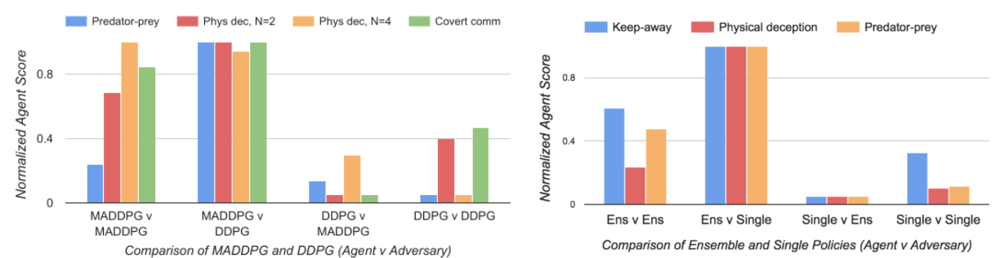

# Multi-Agent Actor-Critic for Mixed Cooperative-Competitive Environments
#### Lowe *et al.* (2018)

Policy-Gradient methods (REINFORCE, Actor-Critic) already struggle with high variance of estimated gradients. Well guess what, the probability of estimating a gradient of the correct direction descreases *exponentially* as the number of learning agents grows in the environment. In thiswork, the authors propose a new algorithm, **Multi-Agent Deep Deterministic Policy Gradient (MADDPG)**, that performs better on multi-agent RL problems than a naïve application of PG methods to multi-agent.

**Key idea :** Centralized Training and Decentralized Execution
* This means that an agent *i* uses a *global observation* of the environment at training time, but only has access to more restricted *local observations* at test time. They implement that by using a *Global Value-Network* (only used for training) which takes as input an observation vector *x* (which contains global information about the environment and local observations of our agent) and the selected actions of each other agents *a1*, *a2*, ..., *aN*. 
* **Drawback:** the size of the Critic input space increases linearly with the number of agents.

**Why it works :** They suggest that naïve applications on RL methods to multi-agent problems struggle because of the nonstationarity of the environment (from the point of view a any single agent), which is inherent to having multiple learning agents interacting. Using the Global Value-Network makes the environment stationary again from the point of view of a single agent.

**Simply put :** An Actor-Critic method for which the Critic has access to global information while the Actor only has access to local information.

### Why not doing that with Deep Q-Learning ?

Q-Learning can be naïvely applied to multi-agent settings by having one Q-Value-Network for each agent *i*. However, for the same stationarity issue, this violates the Markov assumptions required for convergence of Q-Learning. Also, it is not straightforward to use a different unput space at training and test time with that approach (whereas with Actor-Critic we simply drop the Critic at test time, like usual). Also, the Experience Replay Buffer cannot be used in this setting (because the environment is highly nonstationary, it does not make sense to keep learning on past transitions).

### Ensemble of policies  (other relevant trick)

To obtain multi-agent policies that are more robust to the changes in the policies of their competing agents (bref, to avoird overfitting the opponent), they train a collection of *K* different subpolicies (3 is a reasonable value for *K*). At each iteration, they randomly select one of the sub-policy for the agent to follow for that episode. They also need to maintain a distinct replay buffer for each sub-policy.

