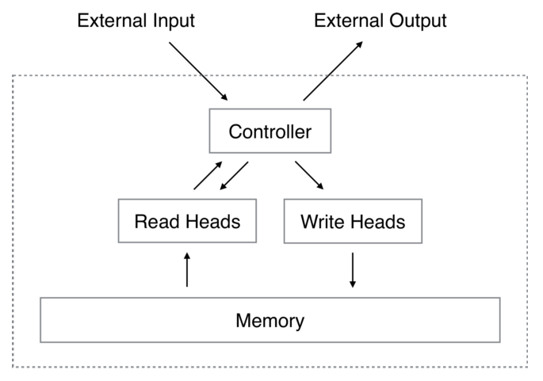
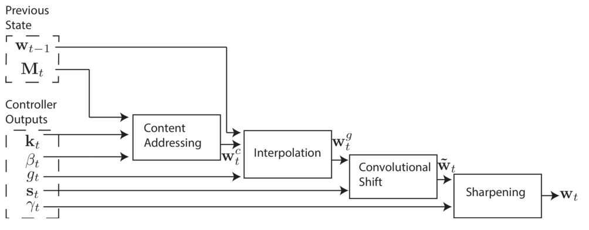
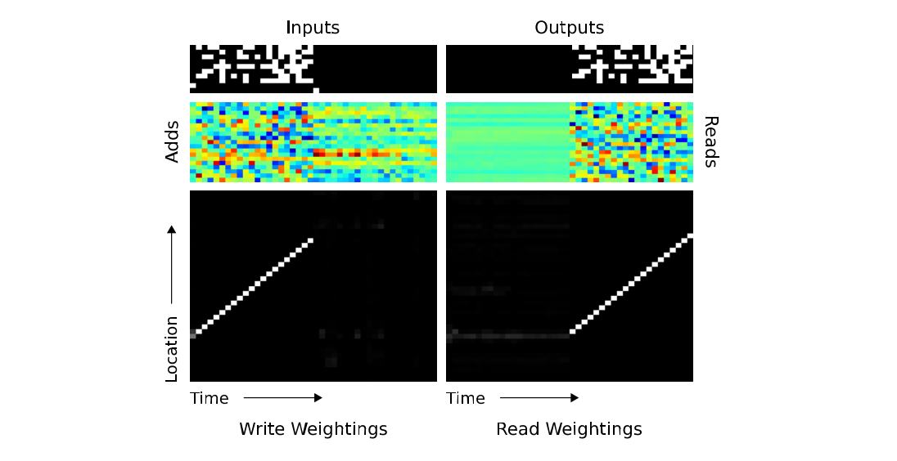

# Neural Turing Machines
#### Graves, Wayne, Danihelka (2014)

The authors develop one of the first approaches for incorporating external memory to neural network systems. They show that this model outperforms LSTM at simple tasks that require using memory. NTM is even shown to implement simple algorithms in a very similar way to a human would do.

### High-level Functioning

The memory is a matrix **M** of shape (N x M), where N is the number of memory locations and M is the dimensionality of the momery vectors (one vector per location). The model *soft* reads and writes to the external memory (that allows the model to be end-to-end differentiable). A weighting vector **w** defines on which location to focus.

* **Reading** : Simply returns a *read vector* **r** which is a weighted sum of all memory vectors contained in the external memory.

* **Writing** : Uses an *add vector* **a** and an *erase vector* **e**. 
	* First, the erase vector is used to erase memory : **M**(i) *= (**1** - **w**(i)**e**)
	* Second, the add vector is used to add new information : **M**(i) += **w**(i)**a**

* **Adressing** : Process by which the weighting vector **w** is defined. It goes through 4 steps :
	1. Content adressing - takes a *key vector* **k** produced by the writing head and defines the weight for each location **w**(i) by comparing the key vector to every memory vector using a similarity measure (e.g. Cosine Similarity)
	2. Interpolation - linearly interpolate between last step's weighting vector and content-weighting vector
	3. Convolutional Shift - allows to shift the location focus within a predefined maximum range (location based adressing) through rotational convolution
	4. Sharpening - simply sharpens the final weighting vector's focus

<table>
	<tr>
		<td>
			

			
			
			

		</td>
	</tr>
</table>

### Experiments

Five increasingly interesting experiments have been realised. NTM uses its external memory and performs well in all of them.

1. **Copy** - copy a long input sequence (verify if NTM can effectively adress, write and read to its memory)

2. **Repeat Copy** - copy a short input sequence for a specified number of times (verify if NTM can implement nested function)

3. **Associative Recall** - takes a long input sequence and output the next-element of a queried-element (verify if NTM can use content-based and location-based adressing in a combined fashion)

4. 

5. 

### Main conclusions

The NTM do uses its external memory and it allows it to learn faster and generalize better than an LSTM in all the reported experiments.
