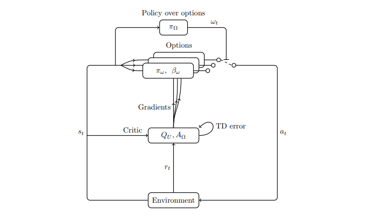
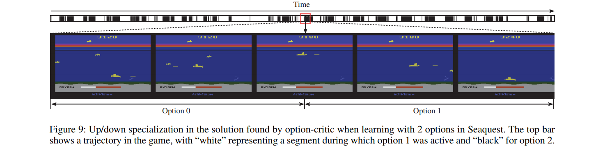

# The Option-Critic architecture
#### Bacon, Harb and Precup (2017)

In this work, the authors propose an framework that allows to learn end-to-end (1) a policy over options, (2) their respective termination functions and (3) their respective intra-option policies. This allows to train RL agents with temporal abstractions without major slowdown compared to non-hierarchical model-free algorithms.

### Theoretical contribution

Their main contribution is to derive the *Intra Option Policy Gradient Theorem* and the *Termination Gradient Theorem* to allow this end-to-end training (see paper section *Learning Options* for details).

### Experiments

They test the Option-Critic algorithm in 3 setups:
    *  four-rooms discrete environment
    *  pinball (continuous small state vectors)
    *  Arcade Learning Environment (continuous large state vectors)

On four-rooms, they show that Option-Critic adapts more quickly after an environment change than SARSA or Actor-Critic. On ALE, they show that the agent can learn competitive policies in these more challenging environments and that it can learn interpretable options when the number of options is judiciously chosen (up/down options for seaquest). They also use 3 interesting tricks for training on ALE:
    * **Termination regularization** (option-stretching): they add a small baseline to the option-advantage function so that the agent does not terminate options too often.
    * **Entropy regularization**
    * **Baseline to intra-option polcy**: they add the value over options as baseline in the intra-option policy gradient estimator to reduce its variance.

