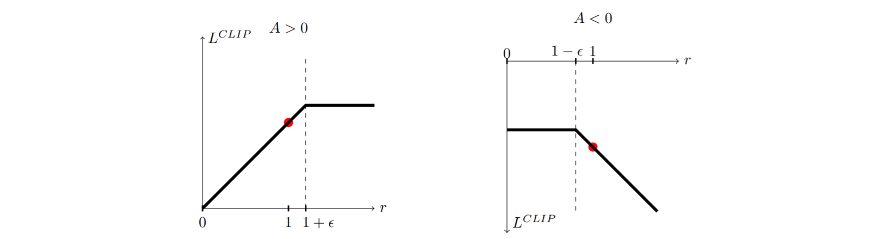

# Proximal Policy Optimization Algorithms (PPO)

#### Schulman *et al.* (2017)

In this work, the authors propose a new algorithm that builds on the idea brought up by TRPO to garantee monotonic policy improvement but that is much simpler to implement and understand.

### Main points

It works by clipping the unconstrained surrogate loss proposed by TRPO, where *r_t* is the probability ratio between old and updated policy for a given state-action pair:

*
*
*

