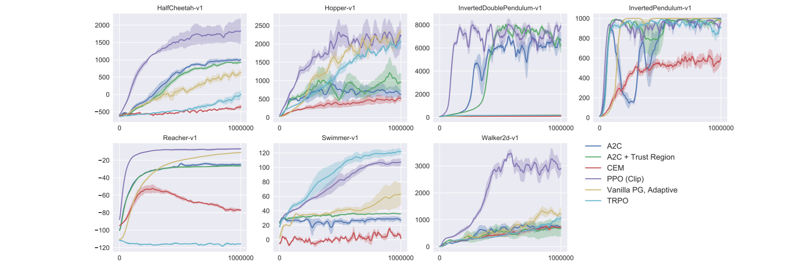

# Proximal Policy Optimization Algorithms (PPO)

#### Schulman *et al.* (2017)

In this work, the authors propose a new algorithm that builds on the idea brought up by TRPO to garantee monotonic policy improvement but that is much simpler to implement and understand.

### Main points

It works by clipping the probability ratio *r_t* in the unconstrained surrogate loss proposed by TRPO, where *r_t* is the probability ratio between old and updated policy for a given state-action pair:

* On-policy algorithm
* Clipped probability ratio which forms a lower bound on policy improvement
* Allows minibatch updates (alternate between interacting and learning)
* Simple to implement (a few line differences from an A2C implementation)

### Experiments

They compare performance on both continuous (Mujoco) and discrete (Atari) control tasks and show better or equivalent performance than most state of the art policy gradient algorithms including A3C, ACER, TRPO.

