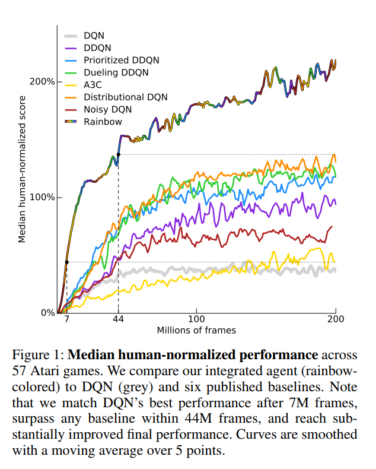
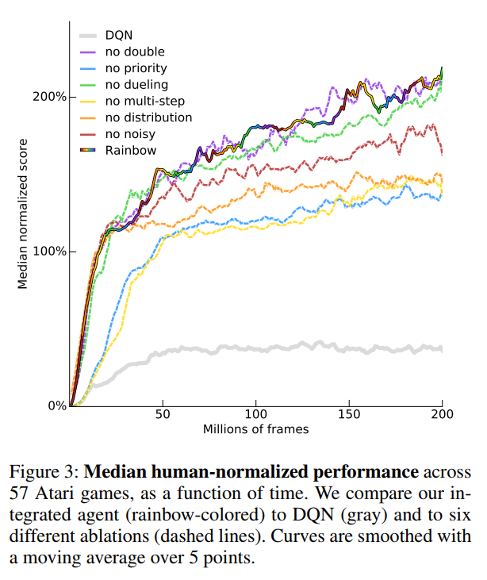

# Rainbow : Combining Improvements in Deep Reinforcement Learning
#### Silver et al. (2017)

In this paper, the authors combine 6 recent and complementary improvements over Deep Q Networks (DQN) into a single model called *Rainbow*. 

### Combined models

* Double Q-learning
* Dueling Netwroks
* Prioritized Replay
* Multi-step Learning
* Distributional RL
* Noisy Nets

### Experiments and results

The authors train Rainbow and the 6 variants of DQN on 57 Atari games. Rainbow perform best than any individual variation. They also analyze which models contribute the most to Rainbow by performing an extensive ablation study. The results suggest that *Multi-Step Learning* and *Priority Replay* are the most important add-ons, followed by *Distributional RL* and *Noisy Nets* in 3rd and 4th place. *Double Q-Learning* might help but as the rewards in their setup were more often underestimated than overestimated, its effect was not really visible. Finally *Dueling Networks* was not found for most games tested and could even be harmful on a subset of them. 

<table>
	<tr>
		<td>
			

			
			
			

		</td>
	</tr>
</table>

