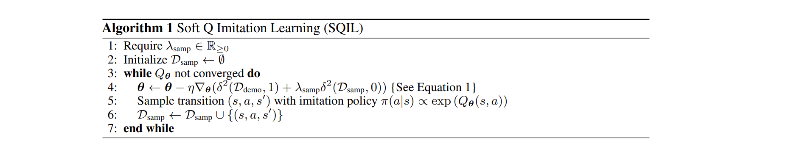

# SQIL: Imitation Learning via Reinforcement Learning with Sparse Rewards
#### Reddy et al. (2019)

In this work, the authors present a novel, surprisingly simple algorithm for Imitation Learning that performs on par or better than GAIL without requiring the use of an adversarial framework to learn a cost function.

**Setup:** The agent does not observe a reward signal, cannot query the expert and doesn't know the state transition dynamics.

### Algorithm

Key idea: Incentivize the agent agent to match the demonstrations over long time horizons by encouraging it to come back to demonstrated states when it has drifted to out-of-distribution states. This is simply implemented with three simple modifications to [Soft Q-Learning](https://dl.acm.org/doi/10.5555/3305381.3305521) for discrete control (or [SAC](https://arxiv.org/abs/1801.01290) for continuous control):

  * At initialisation, fill the experience replay buffer with expert trajectories (demonstrations) with rewards set to r=1
  * Adds new transitions encoutered by the agent to the replay buffer with reward r=0
  * When sampling from the replay buffer, balance 50-50 the number of demonstration v.s. encountered transitions

**Note:** Since SQIL is an off-policy algorithm, it simply puts the demonstrations in its buffer and does not actually need to ever encounter them when interacting with the environment, making it a good choice for stochastic, continuous and/or high-dimensional state space problems.

### Theoretical contributions

The authors show that SQIL is equivalent to Behavioral Cloning that uses a regularisation penalising the magnitude of the rewards implied by the soft Q-values (RBC). More precisely, they show that the gradient of RBC s proportional to the gradient of the SQIL loss plus an additional term that penalises the soft values of the initial state.

Such a penalty helps to overcome state distribution shift. This regularisation term is important because:

  1. It imposes a sparsity prior
  2. It incorporates information about the state transition dynamics into the imitation learning objective

### Experiments

