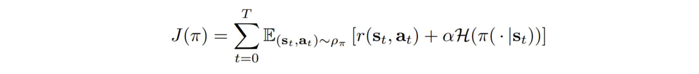

# Soft Actor-Critic: Off-Policy Maximum Entropy Deep Reinforcement Learning with Stochastic Actor
#### Haarnoja, Zhou, Abbeel and Levine (2018)

In this work, the authors propose a new algorithm called Soft Actor Critic (SAC) which learns stochastic policies using off-policy data, the actor-critic parametrization and the maximum entropy framework. The main motivation is to alleviate two important limitations of model-free RL methods: very high sample complexity and brittle convergence properties (difficult hyperparameter tuning).

### Soft Policy Iteration (theoretical foundation)

Starting from the Maximum Entropy objective:

they motivate their algorithm by deriving a stochastic version of the Policy Iteration algorithm (a well studied tabular algorithm), which they call *Soft Policy Iteration*, and show that by alternating between policy evaluation and policy improvement steps, the algorithm converges to the optimal policy.

This convergence proof uses two lemmas, (1) that the policy evaluation steps converge to the policy value and (2) that the policy improvement step leads to equally good or better valued policies according to the current value function. The proof of their first lemma is quite simple. They re-define the reward as the standard reward plus a term taking into account the entropy of the distribution, and then piggy-back on the standard result for policy iteration evaluation (see Sutton and Barto's textbook). The second one is less trivial. 

### Soft Actor Critic (practical algorithm using neural nets)
